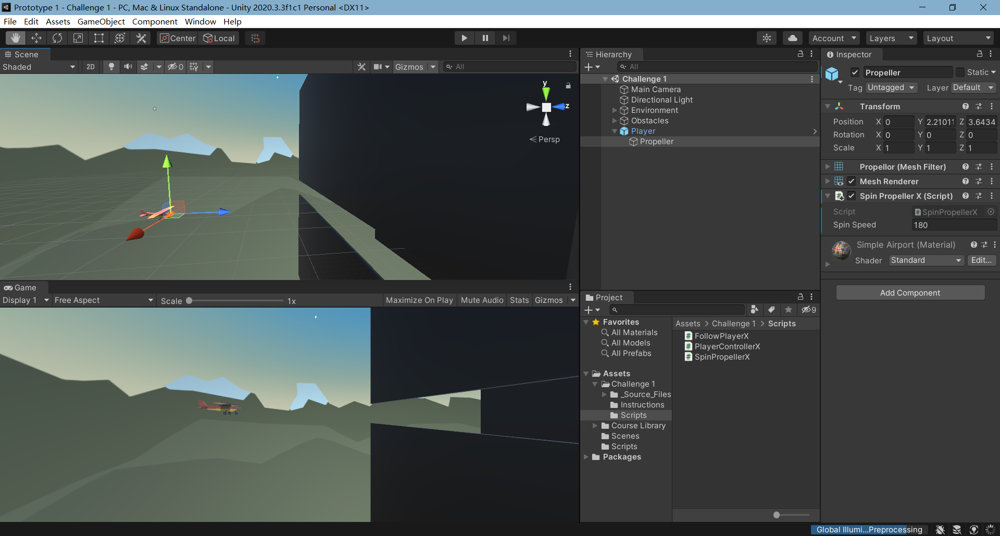
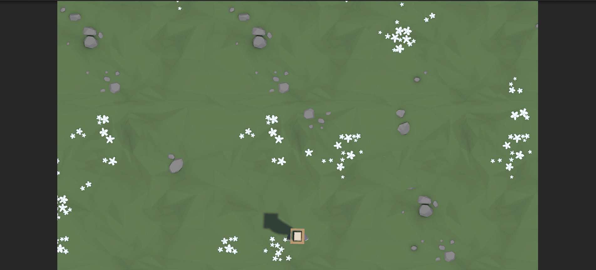
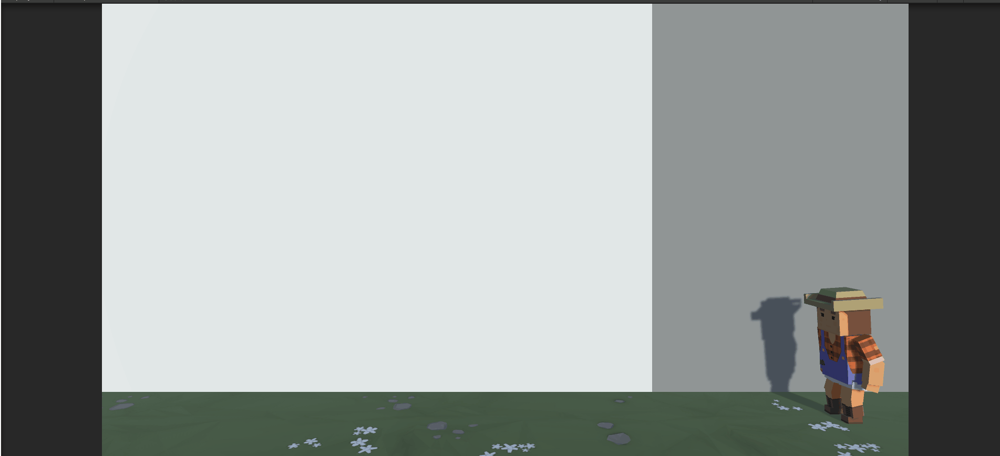
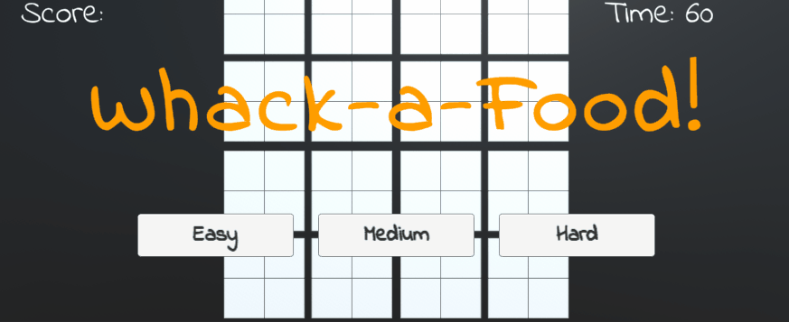

# Unit1

## Prototype1

**汽车的驾驶**

**双人模式展示**

## Chanllenge1

**飞机的驾驶**

# Unit2

## Prototype2

**喂动物吃香蕉**

## Chanllenge2

**狗接球**

# Unit3

## Prototype3

**跨栏**

## Chanllenge3

**气球**

# Unit4

## Prototype4

球球碰撞

## Chanllenge4

# Unit5

## Prototype5

**水果忍者**

## Chanllenge5

**点击食物**

